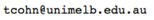

    

 
    

	  

	    

	      <b>Trevor Cohn</b>
	       Professor 
	      <address>
		Room 323 
		Doug McDonnell Building (#167)
	      </address>
	    

		

		  <a href="http://www.cis.unimelb.edu.au">Computing and Information Systems</a> 
		  <a href="http://www.unimelb.edu.au">The University of Melbourne</a> 
		  <a href="http://uom-nlp.github.io/">Natural Language Processing group</a>
		

	  

	  

	    

	
	<noscript></noscript>
	    

	    
 Ph: +61383441732 

	    

	

    

  Understanding of human language by computers has been a central goal of
  Artificial Intelligence since its beginnings, with massive potential to
  improve communication, provide better information access and automate basic
  human tasks. My research focuses on technologies for automatic processing of
  human language, with several applications including automatic translation 
  (akin to <a href="http://translate.google.com">Google</a> and
  <a href="http://www.bing.com/translator">Bing's</a> translation tools). 
  My core focus is on probabilistic machine learning modelling
  of language applications, particularly handling uncertain
  or partly observed data and structured prediction problems.

<h3>News</h3>
<ul>

  <li><i>{{ item.date }}</i>: {{ item.text }}</li>

</ul>

<h3>Recent Papers</h3>



